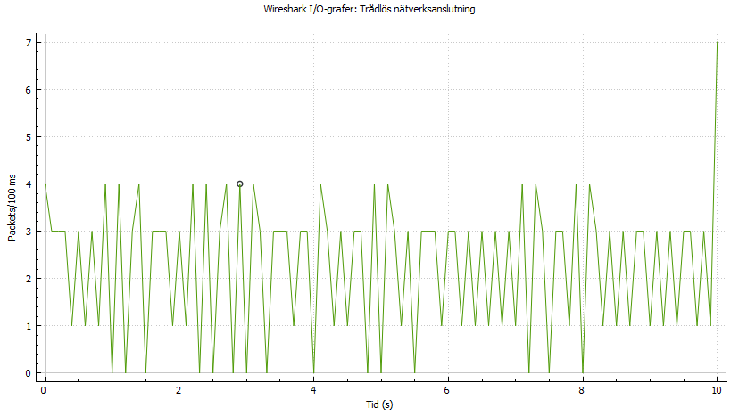

# Rikard Larsson, 9906075073, ET1447, 2022-02-22

### A1

<pre>
# Rikard Larsson Rilr20 BTH
# Sändare

#50ms asvstånd
#kunna skjustera tiden mellan utskicken
#skicka paket i 10sekunder
#mindre än 1500bytes stora
#inkludera ett meddelande nummer
#10001;
#10002;
#avsluta med fyra ####

from socket import *
from datetime import datetime
import time

serverName = '192.168.1.112'
serverPort = 12000
waittime = 0.05
time_to_end = 10

waittime = input("Put in your waittime default is 0.05 seconds: ")
if waittime == ""  or waittime.isalpha():
    print("using default")
    waittime = 0.05

time_to_end = input("how many seconds should program run: ")
if time_to_end == "" or time_to_end.isalpha():
    print("using default 10 seconds")
    time_to_end = 10
#skapar paketet
packet_size = 1400
message = ""
for i in range(0, int(packet_size/2)):
    message += "ä"

# create UDP socket
clientSocket = socket(AF_INET, SOCK_DGRAM)

i = 10000
start_time = datetime.now()
while True:
    i += 1
    # package = f'{this_list[i]};{message}####'
    package = f'{i};{message}####'
    # clientSocket.send(package.encode())
    clientSocket.sendto(package.encode(),(serverName, serverPort))
    print(f'package {i}')
    time_delta = datetime.now() - start_time
    time.sleep(float(waittime))
    if time_delta.total_seconds() >= int(time_to_end):
        break

clientSocket.close()

</pre>

### A2

<pre>
# Rikard Larsson Rilr20 BTH
# Mottagare

#kolla paketnummret
#är det för högt? 10005 => 10007
#kommer de i rätt ordning? 10006 => 10005
#det ska loggas för att se om det är i ordning eller inte

from socket import *
serverPort = 12000

# create UDP socket and bind to specified port
serverSocket = socket(AF_INET, SOCK_DGRAM)
serverSocket.bind(('', serverPort))

print ("The UDP server is ready to recieve")
prev_package = 10000
while True:
    # read client's message and remember client's address (IP and port)
    sentence, clientAddress = serverSocket.recvfrom(2048)
    decoded = sentence.decode()
    split_sentence = decoded.split(";")
    # Print message and client address
    # print (sentence.decode())
    # print (clientAddress)

    # if not sentence:
    #     print("now i close")
    #     connectionSocket.close()
    #     break
    # print (f'paketnummer {split_sentence[0]} {split_sentence[1][:-4]}')
    if prev_package+1 == int(split_sentence[0]):
        print(f'correct package arrived: {split_sentence[0]}')
    elif prev_package < int(split_sentence[0]):
        print(f'wrong package arrived too large expected {prev_package+1} got {split_sentence[0]}')
    elif prev_package > int(split_sentence[0]):
        # print(split_sentence[0])
        # print(prev_package)
        print(f'wrong package arrived too small expected {prev_package+1} got {split_sentence[0]}')

    prev_package += 1

</pre>

### A3
Jag använder mig av sleep för att göra någon sorts delay. När programmet startar så kan man själv bestämma hur stor delay det ska vara. Jag satte att 0.5 är förinställt om man inte skickar in sin egna delay. 

När jag testar så skickas bara 160paket av de 200 som borde skickas under 10 sekunder. Kanske är mer delay än väntat? eller pythonkoden som är långsammare?

Den skickar ett paket och sedan sedan sover den innan den kan skicka nästa paket. 

### B1a) 
Jag använde mig av 0.047s för att få 20 meddelande på 1 sekund. 

### B1b)
Men detta fungerade bara för 1 sekund, då det inte verkar vara stabil. Jag satte att den skulle skicka under 10 sekunder då fick jag bara 179/200 paket som då ska skickas. Så det krävs kanske ännu mer finsjustering för att få den perfekt. För att få det att fungera relativt bra för 400 paket så användes 0.0458 sekunder. Där fick man 404/400 paket
### B1c)
visa I/O-grafen över utgående streamingtrafik hos sändaren 

### B1d)

Mottagaren har fler toppar än vad sändaren har. Detta kan bero på att datan inte är samlad på samma gång. Vilket kan ge en skillnad mellan graferna
### B1e)
När jag provade köra programmet första gången så försvann 3 paket 10295, och 10296. Detta gjorde så att mitt program klagade på resten av paketen var i oordning. Detta skedde unda "normala" förhållanden då jag inte hade extra program öppet som tar mer internet. 

### B2a)
Det finns ingen bra tid för att komma nära 50 meddelanden per sekund. jag använder mig av 0.015 vilket ger 1120 meddelanden på 20 sekunder. Detta är 120 paket fler än de förväntade 1000. Att försöka optimera det mer funkar inte då det av någon anledning sjunker till runt 800 paket skickade. 

Förutom detta så ser det ut som att den skickar i en jämn takt. 
### B2b)
<!-- sändarens taffik -->

### B2c)
<!-- mottagande traffik -->

### B2d)
Ja det finns en tydlig skillnad mellan de två. Sändaren skickar i samma takt. Medans mottagaren har ett par spikar. Jag kan inte riktigt förklara varför de är där. Men precis innan 10 sekunder så är det där de 10 paketen försvann. Men det syns inte på grafen.

Något annat man ser är att de har samma "mönster". Det finns två typer av toppar en som är vass och en som är lite plattare. Detta möstret ser ut att spegla hur sändaren skickar till mottagaren.
### B2e)
Paketen kommer i rätt ordning tills det av någon anledning försvann 10 paket. Utskriften fungerar bra tills paketen försvinner för då blir utskriften fel för resten av paketen. 

### B2f)
Jag förlorade nästan 10 paket samtidigt så paketen från 10625 till 10633 försvann. Vet ej om det försvann fler paket då det blir svårläst när det går så fort och consolen sparar inte alla utskrifter.

### B3a)
Under 10 sekunder så skickades det 92120 paket. Vilket blir ungefär 9210 paket per sekund; wireshark sa att det var runt 8000paket per sekund som skickades. Detta blir för snabbt för mottagaren och hinner inte kolla paketnummret är för stort eller för litet.

wireshark I/O med 1ms intervall
### B3b)
176337 paket skickades under 10 sekunder. Betydligt högre än när man använder sleep på 0. Wireshark säger att det är runt 8500 paket som skickas per sekund. 

wireshark I/O med 1ms intervall

Av någon anledning så slutas det skickas paket vid samma tillfälle.
### B3c)
Det jag tror begränsar frekvensen av utskicket är Python. Om man skriver koden mer optimerad så hade man kunnat skicka fler paket. Alla paketen går genom routern vilket kan flaskhalsa för mottagaren. Men det blir ändå för snabbt för mottagaren att kolla på alla paket och se om paketnummret är rätt eller ej. 

### C1a)
<pre>
#SÄNDAREN
from socket import *
from datetime import datetime
import time

#destinations porten
serverName = '192.168.1.31'
serverPort = 12000
#changes the speed of messages is sent
time_to_end = 10
waittime = 0.05

waittime = input("Put in your waittime default is 0.05 seconds: ")
if waittime == ""  or waittime.isalpha():
    print("using default")
    waittime = 0.05

time_to_end = input("how many seconds should program run: ")
if time_to_end == "" or time_to_end.isalpha():
    print("using default 10 seconds")
    time_to_end = 10

# waittime = 0.05
#converts to integer
# waittime = int(waittime)
#skapar ett meddelande som är 1400 byteslångt
packet_size = 1400
message = ""
for i in range(0, int(packet_size)):
    message += "a"
# create TCP socket on client to use for connecting to  remote server
clientSocket = socket(AF_INET, SOCK_STREAM)

# open the TCP connection
clientSocket.connect((serverName, serverPort))

# Input sentence from keyboard
# sentence = input('Input lowercase sentence: ')

# ska köra i 10 sekunder sedan sluta
i = 10000
# this_list = [1,2,3,4,5,6,7,8,9,10,11,13,12,14,15,16,17,18,17,19]
start_time = datetime.now()
# while i < len(this_list):
while True:
    i += 1
    # package = f'{this_list[i]};{message}####'
    package = f'{i};{message}####'
    clientSocket.send(package.encode())
    # print(f'package {i}')
    time_delta = datetime.now() - start_time
    time.sleep(float(waittime))
    if time_delta.total_seconds() >= float(time_to_end):
        break

# close the TCP connection
clientSocket.close()

</pre>
### C1b)
<pre>
#MOTTAGAREN

from socket import *
serverPort = 12000

# create TCP welcoming socket
serverSocket = socket(AF_INET, SOCK_STREAM)
serverSocket.bind(('',serverPort))

# server starts listening for incoming TCP requests
serverSocket.listen(1)

print ('The TCP server is ready to receive')

connectionSocket, addr = serverSocket.accept()
prev_package = 10000

while True:
    # server waits for incoming requests; new socket created on return
    # read sentence of bytes from socket sent by the client
    sentence = connectionSocket.recv(4096).decode()
    split_sentence = sentence.split(";")
    # print package number and sentence
    if not sentence:
        print("now i close")
        connectionSocket.close()
        break
    # print (f'paketnummer {split_sentence[0]} {split_sentence[1][:-4]}')
    # print(split_sentence[0])
    if prev_package+1 == int(split_sentence[0]):
        print(f'correct package arrived: {split_sentence[0]}')
    elif prev_package < int(split_sentence[0]):
        print(f'wrong package arrived too large expected {prev_package+1} got {split_sentence[0]}')
    elif prev_package > int(split_sentence[0]):
        # print(split_sentence[0])
        # print(prev_package)
        print(f'wrong package arrived too small expected {prev_package+1} got {split_sentence[0]}')

    prev_package += 1
    # print()
    # if int(split_sentence[0]) >= 10:
    #     print('I close :(')
    #     connectionSocket.close()
    #     break
</pre>
### C2a)
Den verkar vara ganska stabil då den skickar runt 20 meddelande per sekund.
### C2b)

### C3a)
Den verkar vara stabil
### C3b)

### D1)
Det enda som hände var att paket försvann och aldrig att de kom i oordning.
TCP så skapas det en anslutning vilket gör att denna anslutningen är kopplat dinn sändaren tills mottagaren vill stänger av. Detta har inte UDP och jag gissar på om jag hade haft två datorer som sändare så kan båda två skicka till mottagaren.

TCP känns långsamare i programkoden då den väntar på att hela paketet skickas. Vilket förklarar ett problemet jag hade med att TCP fungerade bra på en långsam hastighet men när det blev snabbt så hängde det inte med och då skapade problem i min kod. 

### D2)
I början råkade jag skriva programmet i TCP istället för UDP. Men det var ingen större problem för det fick man användning för senare. Men TCP kunde skicka och ta emot paket lokalt men det var svårare att få det att fungera til en annan dator. Det gick men långsam hastighet men när det skulle skicka 20 paket i sekunden så blev det problem.

TCP programmet fungerar inte riktigt som det ska då det av någon anledning förlorar varje tredje paket. Har försökt att fixa problemet men det har jag inte lyckas göra. Men den fungerar bättre än vad den gjorde innan då den bara krashade när skickar många paket samtidigt. Problemet löstes genom att öka receiver bufferten